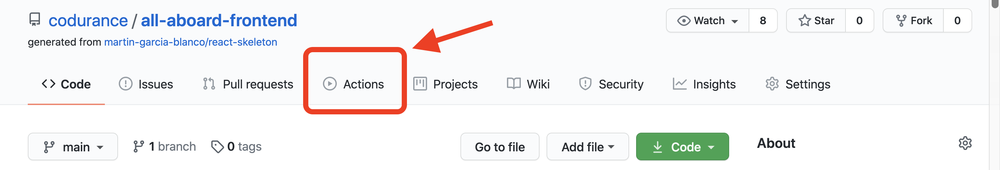
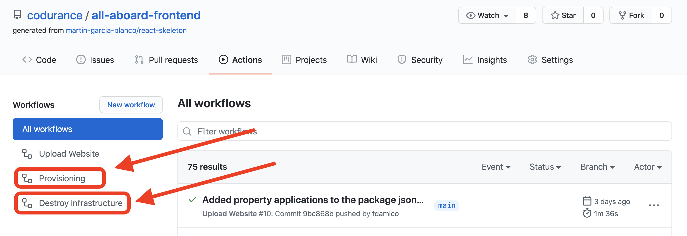
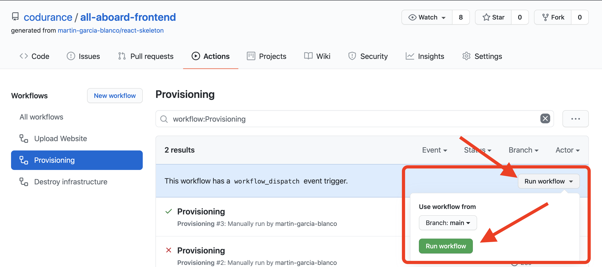

# ***AWS infrastructure (Provisioning and destroy)***
There are 2 different [GithubActions](https://github.com/features/actions), the first one is the provisioning action and the second one the destroy action.

- ***Provisioning:*** this action will automatically create and configure an AWS S3 bucket and configure it to work as a static web site
  - Necessary secrets:   
  `Information stored in BitWarden (secure notes -> AllAboard)`
    - AWS_ACCESS_KEY_ID 
    - AWS_SECRET_ACCESS_KEY 
    - AWS_REGION
  - Github action steps: 
    - Create S3 Bucket
    - Configure Web hosting
    - Configure access control
    - Put S3 Policy

- ***Destroy:*** this action will automatically remove the content of the S3 bucket and delete it permanently.

 `These actions have a button to trigger them, this button is on Github.`

