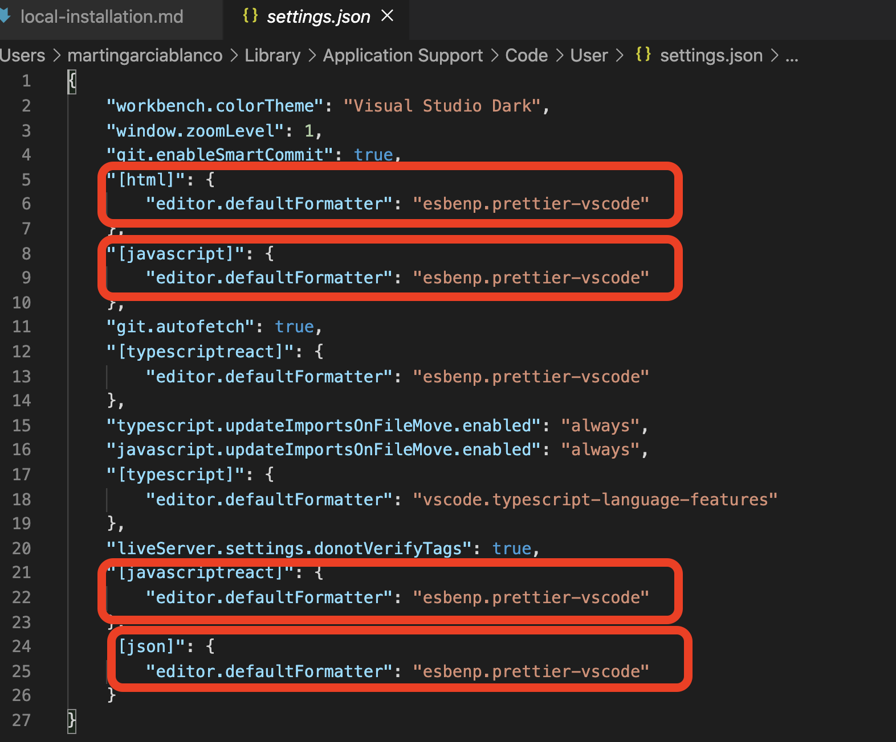
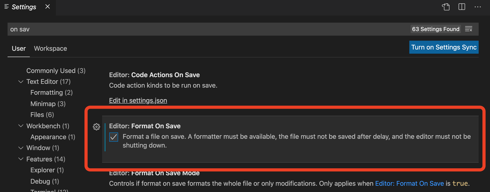

# **Local installation**

- Clone the repository.

```
git clone https://github.com/codurance/all-aboard-frontend
```

- Move inside of the folder all-aboard-frontend.

```
cd all-aboard-frontend
```

- Install the dependencies.  
  Since the beggining we always worked with yarn so we encouraged you to continue using it.

```
yarn install
```

- You will need to manually add .env to root folder. The information of the .env is stored in `BitWarden (secure notes -> AllAboard)`. The .env file will have to contain REACT_APP_GOOGLE_OAUTH_ID="your-id' property, this will allow you to run authentication locally.
  You will also need this property set in the github secrets.
- The front-end was coded with
  [Visual Studio Code](https://code.visualstudio.com/), to facilitate the process we recommend you to install Prettier and ESLint plugins.
- Once you have them installed, it's necessary to choose Prettier as the default formatter.
- From VSCode click `cmd + p` now type `settings.json` and open the configuration file.
- Set html, javascript, javascriptreact and json as

```
"esbenp.prettier-vscode"
```



- If you want to format on save there is a checkbox on vscode settings.
  
